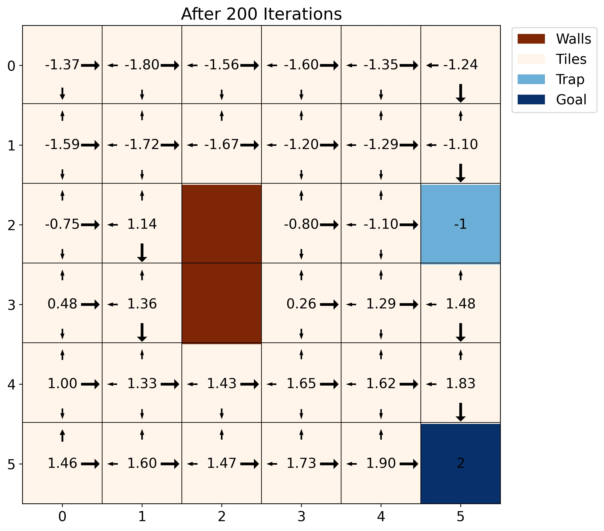
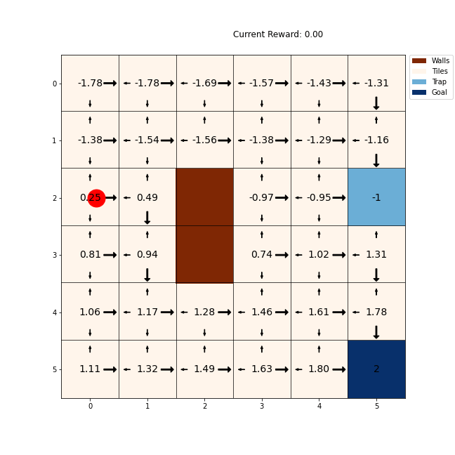

# Submition Week1

## Task 1

1.3 Model Based RL: Accessing Environment Dynamics

Discuss the Policy Evaluation and Policy Iteration algorithms from the lecture. They explicitly make use of the environment dynamics (p(s′,r|s,a)).

• Explain what the environment dynamics (i.e. reward function and state transition function) are and give at least two examples.

Answer: The so called environment dynamics describe how our environment behaves and especially how our environment changes with respect to the agent executing a certain action in a certain state. The environment dynamics consist of: 
- The state transition function, which describes how a certain action in a certain state leads to a different state, and
- The reward function, which describes what rewards we can expect when executing a certain action in a certain state
Example 1:
In a Gridworld the state transition function describes in what way a certain tile can be reached. It could be either deterministic or probabilistic, so in the deterministic case it would always be clear that we end up in state s’ when executing action a in state s, or in the probabilistic case it could be possible that even if we choose action a in state s due to outer environmental influences we end up in a different s’ than we would have expected.
The reward function explains how good a move in a direction or to which tile is. There could be a big reward for reaching a goal state, big cost for reaching a trap or a small costs for every move so that we motivate the agents to get to the goal as fast as possible.
Example 2:
In a self-driving car example the state transition function would describe how likely it is that we end up in the left lane for example if we turn left, but it would also have to take possible actions from the environment into account, so how other drivers behave or that traffic lights change signals.
The reward function would give general rewards for not crashing, driving efficiently or reaching the goal on the fastest route.

• Discuss: Are the environment dynamics generally known and can practically be used to solve a problem with RL?

Answer: The environment dynamics are not always known, for example in 2-player games, where we cannot know what our opponent is going to do or especially in real-world scenarios such as having a self-driving car, where we cannot know what other drivers are going to do or even that it suddenly starts to rain. To solve this problem practically we can try to give a good estimation of certain events that are out of our control and work with expected values.

## Task 2

We decided to build a deterministic gridworld with walls and traps (which kill the agent). 

Our Policy $\pi(a|s)$ is defined like this:
1. The neighboring tile with the lowest Manhatten Distance is being chosen with a probability of 80%. We use argmin, so if there would be a tie, the first valid tile is being chosen.
2. The remaining 20% are evenly distributed over all the other valid neighbor tiles.

We use a penalzier per step of $0.1$ .

We interpretet one 'episode' like this:
1. Sample uniformly one of the tiles as starting tile  .
2. Calculate the reward of a trajectory starting starting from that tile. A trajectory stops if either a trap or the goal is bein reached.
3. Save the final performance of the trajectory for the starting tile to later calcute the mean for each tile. 

Here are the results after 50, 200, 500, 1000 & 10000 episodes each: 

An animation of one trajectory (a especially funny one):

