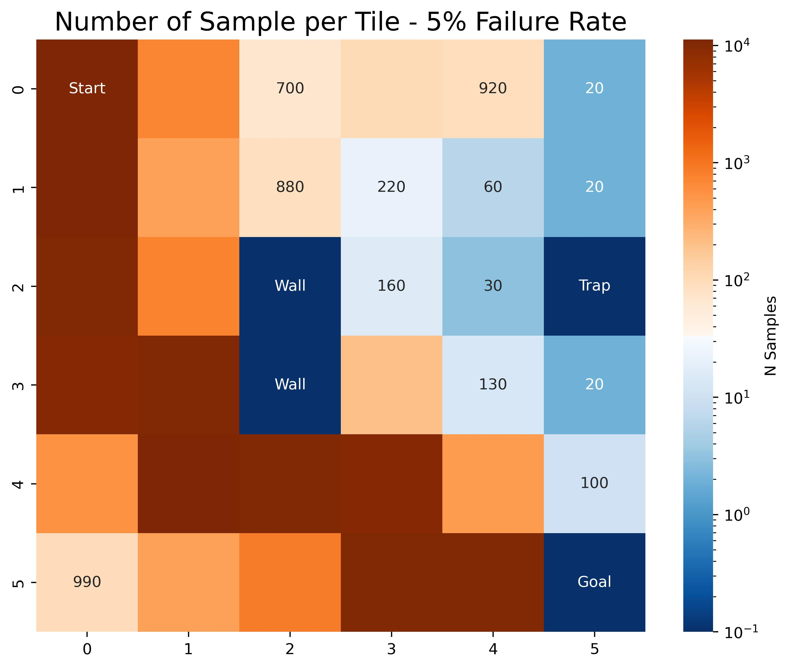
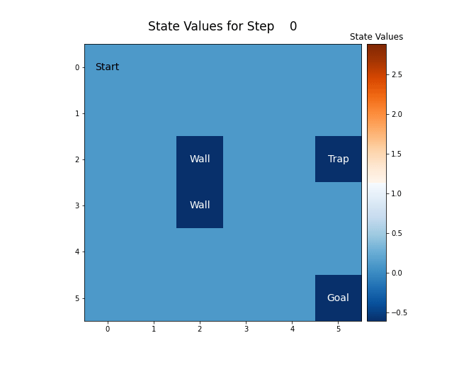

# Submition Week2

## Task 2


We decided changed the our deterministic gridworld to an probabilistic. 

We use a deterministic Policy $\pi(a|s)$, which we initialize randomly at the start.

Our probabilistic state dynamics $p(R_{t+1}|s,a)$ are controlled by the new argument ```probality_wrong_step```, ```which dictates the probability of taking the agent misstepping into a different direction then intended. If an agent missteps, the new direction will be uniformally sampled.  


For the (probabilistic) reward dynamics $p(R_{t+1}|s,a)$ we calculate the average returns of each state action pair.

Our Hyperparameters were:

- ```trap_reward =-1,```
- ```goal_reward = 3,```
- ```cost_per_step = 0.05,```
- ```max_steps_per_episode =200```

This is how an initial state of the bord looks like:


We did 10000 iterations of MC Policy Iteration for two differetn probality_wrong_steps [Failure or Missstep rates]. We used 5% and 10%, which resulted in quite interesting differences. 


### The Policies After 10000 Steps 


###  The average Return-per-Episodes


### Number of samples for each Tile




###  One Episode with 10% Failure Rate after 10000 Iterations


### State-Action Values over Time with 10% Failure Rate for different Steprates




