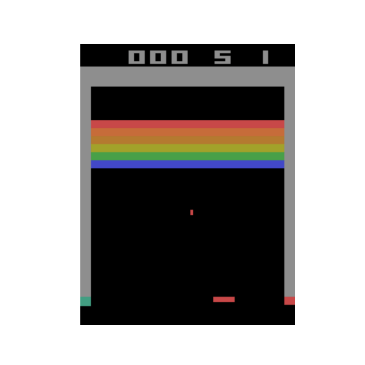

## Week4

We first tested our algorithm on lunar lander:

After achieving satisfactory results, in around 10 minutes, we decided that the code should be good enough for Breakout.

But sadly we struggled to get satisfactory performance for breakout. 
Because of that we looked up the Deep mind atarai implementation details [here](https://github.com/openai/baselines/blob/master/baselines/common/atari_wrappers.py) and an keras example [here](https://keras.io/examples/rl/deep_q_network_breakout/).

They applied reward shaping for dying with an negative reward. Additional they handed a gray scale images of the last 4 frames to the model and used the Huber loss instead of the MSE. After incorpariting this our model started to performe. 

You can see the tensorboard logs of hour roughly 8 hour long training run [here.](https://tensorboard.dev/experiment/NANVlF2nT8mLxiAQJ22Mrw/#scalars)
Note that 'average_termination' how long an episode lasted on average and 'l2_diff' denotes the l2 norm between the q_net and delayed_q_nets predictions.

This is an examplary episode in the later stages of training:

